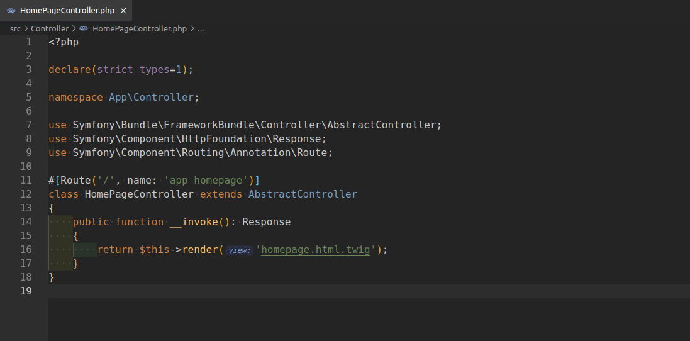

# symfony-go-to-twig README

Alt + click to navigate a twig file.

## Features

## Extension Settings

This extension contributes the following settings:

* `symfony-go-to-twig.quickJump`: enable/disable Ctrl or Alt + click to jump to the first matched file.
* `symfony-go-to-twig.loaderPaths`: Twig loader paths(output of symfony command debug:twig --format=json loader_paths key value)

## Acknowledgements

This project was inspired by:

* [laravel-goto-view](https://github.com/codingyu/laravel-goto-view)

## Known Issues

Calling out known issues can help limit users opening duplicate issues against your extension.

## Release Notes

### 0.0.1

Initial preview release
